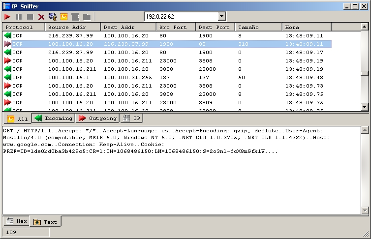



## RAW IP Sniffer v2\.

### Description

a new version with a lot of changes.

To download goto previous submission:

http://www.pscode.com/vb/scripts/ShowCode.asp?txtCodeId=49879
 
### More Info
 

             |
---                |---
**Submitted On**   |
**By**             |[MaRiØ G\. Serrano](https://github.com/Planet-Source-Code/PSCIndex/blob/master/ByAuthor/mari-g-serrano.md)
**Level**          |Intermediate
**User Rating**    |4.0 (16 globes from 4 users)
**Compatibility**  |VB 6\.0
**Category**       |[Coding Standards](https://github.com/Planet-Source-Code/PSCIndex/blob/master/ByCategory/coding-standards__1-43.md)
**World**          |[Visual Basic](https://github.com/Planet-Source-Code/PSCIndex/blob/master/ByWorld/visual-basic.md)
**Archive File**   |

### Source Code

http://www.pscode.com/vb/scripts/ShowCode.asp?txtCodeId=49879

